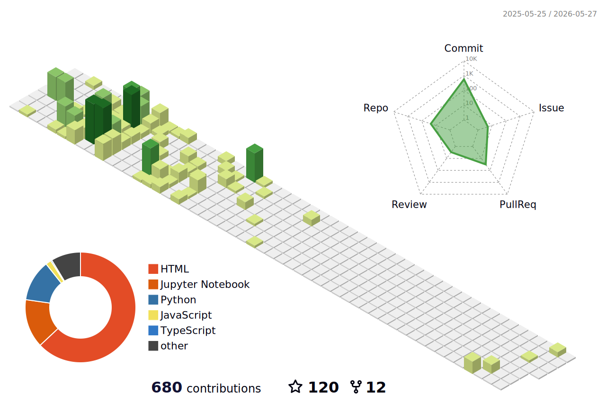

#  Hi, I'm Hamid  

## 🔬 About Me

- 🎓 CS Senior transitioning into full-time AI Research (NLP, LLMs, Agents).
- 💻 Ex-Data Analyst. I care about building grounded, interpretable systems, not just maximizing benchmarks.
- 🚀 Philosophy: *"Talk is cheap. Show me the code."* — Linus Torvalds
- 🌐 Check my **pinned repositories** below to see my actual work, architectures, and implementations.

   

 

## 🌐 Connect With Me

  &nbsp;&nbsp;&nbsp;&nbsp;

  &nbsp;&nbsp;&nbsp;&nbsp;

  <a href="https://hdidit.medium.com/" target="_blank">
    <picture>
      <source media="(prefers-color-scheme: dark)" srcset="https://api.iconify.design/simple-icons:medium.svg?color=%23FFFFFF" />
      <source media="(prefers-color-scheme: light)" srcset="https://api.iconify.design/simple-icons:medium.svg?color=%23000000" />
      
    </picture>
  </a>&nbsp;&nbsp;&nbsp;&nbsp;

  &nbsp;&nbsp;&nbsp;&nbsp;

  &nbsp;&nbsp;&nbsp;&nbsp;

  <a href="https://github.com/hrnrxb" target="_blank">
    <picture>
      <source media="(prefers-color-scheme: dark)" srcset="https://api.iconify.design/simple-icons:github.svg?color=%23FFFFFF" />
      <source media="(prefers-color-scheme: light)" srcset="https://api.iconify.design/simple-icons:github.svg?color=%23181717" />
      
    </picture>
  </a>&nbsp;&nbsp;&nbsp;&nbsp;

  

   

 

## 🛠️ Technical Arsenal

#### 🤖 Agentic & LLM Systems

#### 🧠 ML/DL Frameworks

#### 🗣️ NLP & Speech

#### 📊 Data & Analytics

#### 🛠️ MLOps & Infrastructure

#### 💻 Languages & Databases

#### 📚 Academic NLP Foundations

   

 

## 📈 GitHub Stats & Activity

  

  
  

  
  

  

    <picture>
      <source media="(prefers-color-scheme: dark)" srcset="https://raw.githubusercontent.com/hrnrxb/hrnrxb/output/github-contribution-grid-snake-dark.svg" />
      <source media="(prefers-color-scheme: light)" srcset="https://raw.githubusercontent.com/hrnrxb/hrnrxb/output/github-contribution-grid-snake.svg" />
      
    </picture>

  
  &nbsp;&nbsp;
  
  &nbsp;&nbsp;
  
  &nbsp;&nbsp;
  

   

 
