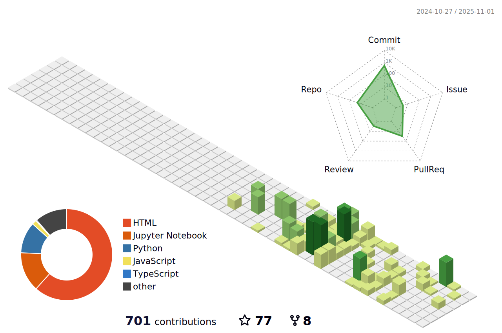

#  Hi, I'm Hamid 

## 🔬 About Me
- 🎓 Computer Engineering Student
- 💻 Junior Data Analyst
- 🔎 Passionate about **Natural Language Processing (NLP)**, **Deep Learning**, **Machine Learning**

---

## 🚀 Tech Stack & Tools

### 🧠 Core Languages & Libraries  

### 🤖 Machine Learning / Deep Learning  

### 🗣️ NLP & Transformers  

### 🛠️ Tools & Platforms  

### 🧮 Data & Visualization  

### ☁️ Deployment & Notebooks  

---

   

 

   

 

## 📈 GitHub Stats

  

  

<a> 
  
  
  
   
</a>

##  GitHub Trophies

---

## 🌐 Connect With Me 

 <a href="https://www.github.com/hrnrxb" target="_blank" rel="noreferrer"> <picture> <source media="(prefers-color-scheme: dark)" srcset="https://raw.githubusercontent.com/danielcranney/readme-generator/main/public/icons/socials/github-dark.svg" /> <source media="(prefers-color-scheme: light)" srcset="https://raw.githubusercontent.com/danielcranney/readme-generator/main/public/icons/socials/github.svg" />  </picture> </a> <a href="https://www.linkedin.com/in/hamid-namjoo/" target="_blank" rel="noreferrer"> <picture> <source media="(prefers-color-scheme: dark)" srcset="https://raw.githubusercontent.com/danielcranney/readme-generator/main/public/icons/socials/linkedin-dark.svg" /> <source media="(prefers-color-scheme: light)" srcset="https://raw.githubusercontent.com/danielcranney/readme-generator/main/public/icons/socials/linkedin.svg" />  </picture> </a> <a href="https://hrnrxb.medium.com/" target="_blank" rel="noreferrer"> <picture> <source media="(prefers-color-scheme: dark)" srcset="https://raw.githubusercontent.com/danielcranney/readme-generator/main/public/icons/socials/medium-dark.svg" /> <source media="(prefers-color-scheme: light)" srcset="https://raw.githubusercontent.com/danielcranney/readme-generator/main/public/icons/socials/medium.svg" />  </picture> </a> <a href="https://www.youtube.com/@HamidDidIt" target="_blank" rel="noreferrer"> <picture> <source media="(prefers-color-scheme: dark)" srcset="https://raw.githubusercontent.com/danielcranney/readme-generator/main/public/icons/socials/youtube-dark.svg" /> <source media="(prefers-color-scheme: light)" srcset="https://raw.githubusercontent.com/danielcranney/readme-generator/main/public/icons/socials/youtube.svg" />  </picture> </a>

###

---

## 💡 Interests & Areas of Exploration

* 🧠 Exploring the depths of **Natural Language Processing** and human language understanding.
* 🤖 Building practical **ML/DL-based tools** that solve meaningful problems.
* 📊 Applying **data analysis and visualization** to uncover patterns in real-world datasets.
* 🧩 Breaking down complex AI research into simple, shareable insights.
* 🛠️ Experimenting with transformers, embeddings, and cutting-edge retrieval-based systems (**RAGs, AI Agents**, and beyond!).
* 🌐 Contributing to the open-source AI ecosystem in my own unique way.
* 🎯 Continuously learning and improving through hands-on coding and active community interaction.

--- 

